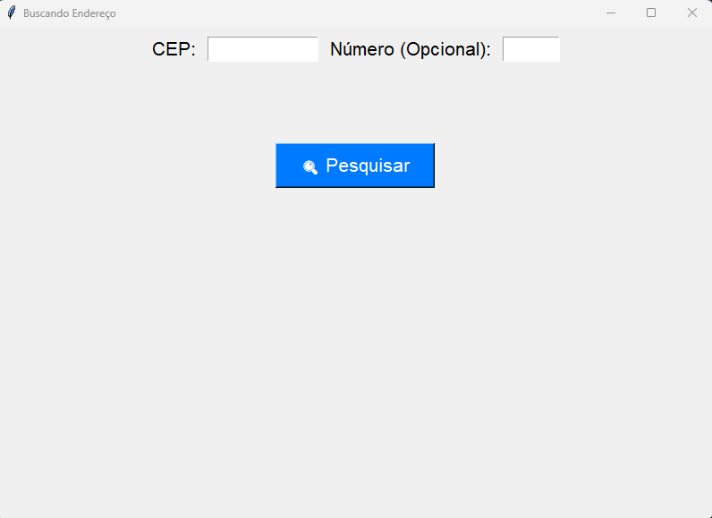

# Este é um aplicativo simples em Python que utiliza a biblioteca `tkinter` para criar uma interface gráfica que permite buscar endereços a partir de um CEP, utilizando a API do ViaCEP.

## 📌 Funcionalidades

- Interface gráfica amigável com `tkinter`
- Consulta de endereços através da API ViaCEP
- Exibição do logradouro, bairro, cidade e estado
- Opção de inserir um número (opcional)
- Mensagens de erro para entradas inválidas

## 📦 Bibliotecas Necessárias

Antes de executar o código, certifique-se de ter as seguintes bibliotecas instaladas:

- `tkinter` (Padrão no Python, não necessita instalação)
- `requests` (Necessita instalação manual)

Para instalar a biblioteca `requests`, utilize o seguinte comando:

```bash
pip install requests
```

## 🚀 Como Executar

1. Clone ou baixe este repositório.
2. Certifique-se de ter o Python instalado (é recomendável usar a versão 3.x).
3. Instale a biblioteca `requests` caso ainda não tenha.
4. Execute o script com o seguinte comando:

```bash
python buscaCep.py
```

## 🖥 Captura de Tela (Opcional)



## 🔗 API Utilizada

- [ViaCEP](https://viacep.com.br/)

## 📄 Licença

Este projeto está sob a licença MIT. Sinta-se à vontade para modificar e utilizar como preferir.

---

Se tiver alguma dúvida ou sugestão, fique à vontade para contribuir! 😊

